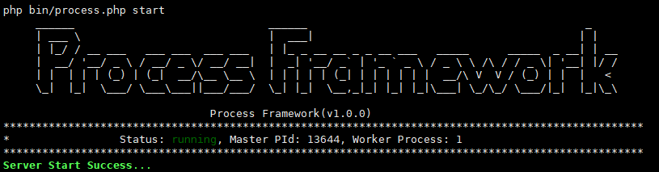
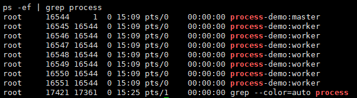

进程服务框架(Process Framework)
========

[](https://app.travis-ci.com/justin-yj/process-framework)
[](https://secure.php.net/)




# 写在开头

---

为了更好的理解进程与文件锁相关的知识，故写了一个小框架，学习相关的知识

# 开发背景

---
使用Swoft时，服务操作会碰到操作失败的情况，原因是PID文件不存在或者被重写，所以写了一个小框架去更好的理解文件锁。

# 简介

---

服务启动后会创建Mster进程，Master进程通过配置文件创建对应数量的work进程和生成PID文件，
PID文件避免两个进程同时运行的文件锁。
Master进程管理Work进程，Work进程处理业务逻辑。



# 运行方式

---

环境要求php7.1以上

1.`mv .env.example .env` 配置.env文件的设置项

2.`composer install` 安装依赖

3.`mkdir log` 创建对应log文件夹


# 参考的方法：

---


- service start

```bash
[root@centos]# php bin/process.php start
```

- service restart

```bash
[root@centos]# php bin/process.php restart
```
- service stop

```bash
[root@centos]# php bin/process.php stop
```


## TODO

---
后补充Socket编程相关，结合使用，用于进程间通信

## 反馈

---


- 如果在使用过程中有任何问题， 请提交 [Issue](https://github.com/justin-yj/process-framework/issues).

## License

---

Apache-2.0


